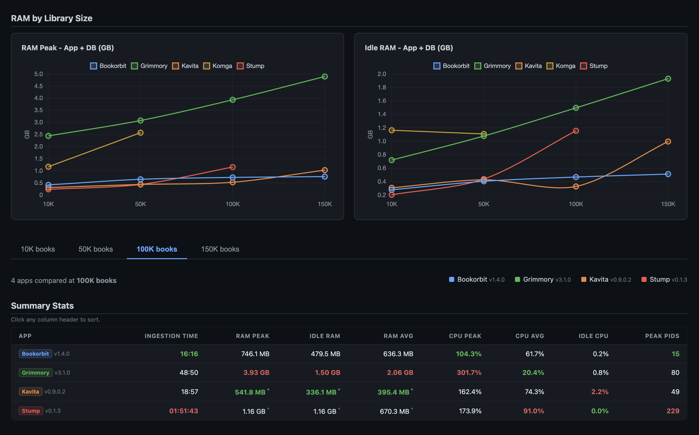

# Book Manager Load Test Benchmarks

A self-contained benchmark suite for comparing library ingestion performance across popular self-hosted book management apps.

**Who this is for:** If you have a small library (a few hundred to a few thousand books), all tested apps will handle it fine and this benchmark will not matter much to you. These tests are aimed at book hoarders - people with 10K, 50K, 100K+ titles where scan times are measured in minutes to hours and memory headroom is a real constraint.

**Hardware used:** Apple M4 Mac Mini, 16 GB RAM, 8 GB RAM and 6 CPUs assigned to Docker Desktop

## Results

**Interactive Comparison Dashboard**
Dive into the full data yourself using the [Interactive Benchmark Dashboard](https://htmlpreview.github.io/?https://github.com/kevin-s722/book-apps-benchmark/blob/main/reference/comparison.html). This pre-built dashboard covers 5 apps tested across up to 4 book counts (10K, 50K, 100K, 150K).



The DB RAM checkbox in the dashboard lets you include or exclude database container memory from the totals. Uncheck it if you plan to use a dedicated external database - the app-only memory will be significantly lower.

## Analysis and Recommendations

All RAM figures include the app container **and** any associated database container
(PostgreSQL for Bookorbit, MariaDB for Grimmory). Kavita, Stump, and Komga run no
external DB - their figures are already total.

## Scope of This Benchmark

This test measures only **ingestion performance and resource usage** - how fast each app scans a library of EPUB files, and how much RAM/CPU it uses while doing so and while idle.

**Who this matters for:** If you have a small library - say under a few thousand books - all of these apps will handle it without breaking a sweat and you likely won't notice the differences measured here. This benchmark is aimed at book hoarders: people with 10K, 50K, 100K+ titles where ingestion time is measured in minutes to hours, idle RAM headroom is a real constraint, and picking the wrong app means waiting an hour for a scan or watching a low-memory device OOM.

It does not cover UI quality, reading experience, mobile apps, OPDS support, shelf/collection management, user management, metadata editing, comic/manga features, Kobo/e-reader sync, plugin ecosystems, community support, or how actively each project is maintained. Those dimensions matter as much or more than ingestion speed for most users, and the rankings here may look completely different if you weigh them.

Use this data to understand resource requirements and initial-scan wait times - not as a final verdict on which app is "best".

---

## Raw Numbers

For the full raw data tables (Ingestion Time, Throughput, Idle RAM, Peak RAM, and CPU Usage), please see [RAW_NUMBERS.md](RAW_NUMBERS.md).

---

## Observations

**Bookorbit** is the fastest at every tested size. Throughput improves as library size increases (65 bk/s at 10K, 110 bk/s at 150K). Idle RAM is reasonable (285-524 MB including PostgreSQL) and grows slowly, but Bookorbit is not the outright lightest on RAM - Kavita beats it at 100K and Stump beats it at 10K. It requires running a PostgreSQL sidecar, which adds complexity and ~160 MB of permanent overhead.

**Kavita** is the second fastest and has some surprising efficiency. At 100K it uses only 336 MB idle RAM (lower than Bookorbit at 472 MB) and 542 MB peak. It stays within 7 seconds of Bookorbit at 50K. At 150K idle RAM jumps to ~1 GB. Handles books and comics/manga in a single app.

**Stump** has the lowest RAM footprint at 10K (209 MB idle, 243 MB peak) and is fast at that scale (3:08). Beyond 50K it collapses: 100K takes 1h 51m and idle RAM hits 1.16 GB. Only viable for small libraries.

**Grimmory** uses significantly more RAM than the others - 2.45 GB peak at 10K, rising to 4.91 GB at 150K (including MariaDB). This is 5-9x more peak RAM than Kavita. Ingestion is slower than Bookorbit and Kavita at all tested sizes, and throughput degrades at scale. On resource-constrained hardware this is a hard blocker. On capable hardware (8+ GB available), resource usage is less of a concern and Grimmory may offer features or a UI that suit some users better - this benchmark does not evaluate that.

**Komga** (JVM) has a hard floor around 1.16 GB RAM even for 10K books. Ingestion of 10K takes 12 minutes (14 bk/s). At 50K it ran for over 1h 51m without finishing. On a resource-constrained machine this rules it out. Komga is widely used for comics/manga and has a mature feature set and active community - if features matter more than ingestion performance and you have enough RAM, it remains a legitimate choice.

**Calibre-Web-Automated** ingestion is not competitive at scale - 1,100 books in 91 minutes for a 10K set. For users who have small libraries or are already invested in Calibre's ecosystem (metadata tools, conversion, format management), it may still make sense. This benchmark only covers ingestion speed.

---

## Recommendations by Use Case

### Low-end hardware (1-2 GB RAM total) - Raspberry Pi, older SBC, NAS with limited RAM

**Bookorbit** for libraries over ~100K, or when ingestion speed is the priority. At 100K and 150K it has lower idle RAM than every other app (472 MB and 524 MB respectively). Throughput scales up with library size so large imports finish faster. It requires a PostgreSQL sidecar, which adds complexity and ~160 MB of footprint - at 10K and 50K that overhead means Bookorbit is marginally heavier than Kavita, so for smaller libraries Kavita is the leaner single-container pick.

**Stump** is marginally lighter at 10K (209 MB vs 285 MB) and is a simpler single-container setup. Fine for small, stable libraries that won't grow past ~20K. Avoid it at 100K+ (idle RAM hits 1.16 GB).

**Kavita** is the lightest single-container option for libraries up to ~100K. At 100K it uses only 336 MB idle - less than Bookorbit's 472 MB (which includes PostgreSQL). At 10K and 50K it is also light (315/437 MB), though Bookorbit edges it out slightly there. At 150K Kavita's idle RAM jumps to 1.02 GB, so for libraries that size Bookorbit becomes the better fit on constrained hardware.

Avoid Grimmory (738 MB idle even at 10K) and Komga (1.16 GB floor at 10K).

### Mid-range server (4-8 GB RAM, 4+ cores) - home server, VPS, Synology NAS

**Bookorbit or Kavita** - both work well across all tested scales. Bookorbit is faster; Kavita uses less peak RAM and requires no database sidecar.

If comic/manga support matters, Kavita handles both in one app.

### Large library (50K-100K books)

Speed: **Bookorbit** (16:16 at 100K vs Kavita's 18:57).
RAM: **Kavita** (542 MB peak, 336 MB idle vs Bookorbit's 758 MB peak, 472 MB idle at 100K).

Both are strong choices. Pick based on whether speed or lower memory pressure matters more for your setup.

### Very large library (150K+ books, extrapolating)

**Bookorbit** - fastest (22:48 vs Kavita's 26:02) and lower idle RAM at 150K (524 MB vs 1.02 GB). Its throughput scales up with library size; Kavita and Grimmory plateau or degrade.

### Speed priority - initial import time matters most

**Bookorbit** across all sizes. The differences are large enough to matter at scale (Grimmory takes 1h 29m for 150K vs Bookorbit's 22:48).

### Low-power always-on device (idle CPU matters)

All apps have negligible idle CPU (under 2.5%). This does not meaningfully differentiate them at rest.

For idle RAM: **Stump** (small libraries) or **Kavita** (mid-to-large libraries) are the lightest single-container options.

### Comic and manga focus

**Kavita** - solid performance, decent RAM, supports books and comics/manga in one app. **Komga** is well-established in the comic community with a mature UI and active development - if you have sufficient RAM (2+ GB available for the container) and primarily care about the reading/browsing experience over ingestion speed, it is worth evaluating on those merits.

### Setup simplicity (no database sidecar)

**Kavita** or **Stump** - single container, drop-in. Bookorbit and Grimmory both require a separate database container.

### NAS deployment (Synology, QNAP, TrueNAS)

**Stump** for libraries under 20K. **Kavita** for libraries 20K-100K. **Bookorbit** if the speed advantage justifies running a PostgreSQL container alongside.

---

## Hardware Requirements (minimum practical)

Peak RAM required during ingestion (app + DB, rounded up). **Min CPUs** is based on peak CPU observed across all runs (100% = 1 core).

| App | Min CPUs | 10K | 50K | 100K | 150K |
|-----|----------|-----|-----|------|------|
| Stump | 2 | 250 MB | 450 MB | 1.2 GB | - |
| Kavita | 2 | 350 MB | 450 MB | 550 MB | 1.1 GB |
| Bookorbit | 2 | 450 MB | 700 MB | 800 MB | 850 MB |
| Komga | 3 | 1.2 GB | 2.6 GB | - | - |
| Grimmory | 4 | 2.5 GB | 3.1 GB | 4.0 GB | 5.0 GB |
| Calibre-Web-Automated | 3 | n/a | - | - | - |

After ingestion, Bookorbit and Kavita release a significant portion of that RAM back - see the Idle RAM table in Raw Numbers for steady-state figures.

---

## Summary

| App       | Fastest ingestion | Lowest idle RAM (total) | Practical ceiling |
|-----------|-------------------|------------------------|-------------------|
| Bookorbit | Yes (all sizes)   | At 50K and 150K        | 150K+ (scales well) |
| Kavita    | Second (close)    | At 10K-100K            | 150K (RAM grows at 150K) |
| Stump     | At 10K only       | At 10K only            | ~20K (degrades beyond) |
| Grimmory  | No                | No                     | Resource-heavy; evaluate on features if hardware allows |
| Komga     | No                | No                     | Mature comic/manga app; evaluate on features if RAM allows |

Bookorbit wins on raw ingestion speed at every size. Kavita wins on RAM efficiency at small-to-mid scale and requires no database sidecar. For most users with libraries under 100K books, Kavita is a strong pick on performance grounds; Bookorbit becomes the clearer choice above 100K or when ingestion speed is the priority. Grimmory, Komga, and Calibre-Web-Automated may offer features, UIs, or ecosystem integrations that outweigh their performance numbers for the right user - this benchmark cannot speak to that.

## Running Your Own Benchmark

### Prerequisites

- Docker Desktop (or Docker Engine)
- Python 3.10+
- Internet access (unless you provide a local Chart.js file with `--chartjs-file`)
- ~40 MB free disk space per 10K EPUBs (the generated EPUBs are ~1.8 KB each)

### Quick smoke test

Before long benchmark runs, validate the environment and scripts:

```bash
cd scripts
./smoke_test.sh
```

### Step 1 - Set up Docker

Each app has a `docker-compose.yml` in `docker/<app>/`. Configure any required credentials or first-run setup yourself - default dev-mode settings were used in the reference runs.

Book volumes are pre-configured with `../../books` as the host source. The container-side mount point varies per app - check the "Library path in container" column in the Apps Tested table above for the path to use when creating a library in each app's UI.

### Step 2 - Generate test books

```bash
cd scripts

# Generate 10,000 EPUBs
python3 generate_books.py 10000
# Output: books/books_10K/  (~40 MB)

# Generate more counts as needed
python3 generate_books.py 50000
python3 generate_books.py 100000
python3 generate_books.py 150000
```

Generation is parallel and typically takes a few minutes per count on modern hardware.

### Step 3 - Run a benchmark (repeat for each app and book count)

Keep things fair: **stop all other app containers before starting the one you are testing.**

**Main terminal:**

```bash
# Example: benchmark Kavita with 10K books

# 0. Stop only benchmark stacks (safe: does not touch unrelated containers)
for app in bookorbit grimmory kavita komga stump calibre-web-automated; do
  docker compose -f "docker/$app/docker-compose.yml" down -v --remove-orphans 2>/dev/null || true
done

# 1. Start only the app under test (run from repo root)
cd docker/kavita
docker compose up -d
cd ../..

# 2. Log in to the app, then create a new library pointing to /books/books_10K
#    Do NOT save/confirm the library yet.
```

**Separate terminal - start the monitor BEFORE triggering the scan:**

```bash
cd scripts
python3 monitor.py kavita_loadtest \
  --label "Kavita v0.9.0.2" \
  --books 10K
```

**Back in the main terminal:**

```bash
# 4. Save/confirm the library in the app UI to trigger the scan.
#    The monitor samples approximately every 5 seconds and stops
#    automatically once idle. Run with --help to see all stop criteria.

# 5. After the monitor finishes it writes:
#      results/kavita_loadtest/<timestamp>_10K/data.csv
#      results/kavita_loadtest/<timestamp>_10K/report.html

# 6. Delete the library in the app, then stop the containers (from repo root)
docker compose -f docker/kavita/docker-compose.yml down -v
```

Repeat steps 0-6 for each book count (10K, 50K, 100K, 150K) and for each app.

### Monitor commands for all apps

```bash
cd scripts

# Grimmory (has DB container)
python3 monitor.py grimmory_loadtest \
  --label "Grimmory v3.1.0" --books 10K \
  --db-container grimmory_mariadb_loadtest

# Kavita
python3 monitor.py kavita_loadtest \
  --label "Kavita v0.9.0.2" --books 10K

# Komga
python3 monitor.py komga_loadtest \
  --label "Komga v1.24.4" --books 10K

# Stump
python3 monitor.py stump_loadtest \
  --label "Stump v0.1.3" --books 10K

# Calibre-Web-Automated
python3 monitor.py calibre_web_automated_loadtest \
  --label "Calibre-Web-Automated v4.0.6" --books 10K

# Bookorbit (has DB container)
python3 monitor.py bookorbit_loadtest \
  --label "Bookorbit v1.4.0" --books 10K \
  --db-container bookorbit_db_loadtest
```

### Step 4 - Generate the comparison dashboard

Once you have results from multiple apps or counts:

```bash
cd scripts
python3 generate_comparison.py
# Output: results/comparison.html
```

Open `results/comparison.html` in a browser to see the cross-app comparison.

> To include the pre-run `reference/` data alongside your own runs, pass both dirs:
> `python3 generate_comparison.py --reports-dir ../results ../reference`

> If your Python environment cannot validate HTTPS certificates, do not disable TLS verification. Instead:
> 1) fix trust roots (for macOS python.org installs, run `Install Certificates.command`), or
> 2) pass a local Chart.js bundle:
> `python3 generate_comparison.py --reports-dir ../results ../reference --chartjs-file ./chart.umd.min.js`

> Note: Calibre-Web-Automated is always excluded from the comparison dashboard due to insufficient data. See the reference results section for details.

## Monitor script reference

Run `python3 monitor.py --help` for the full option list. Key options:

```
python3 monitor.py <container_name> [options]

Options:
  --label TEXT              Human-readable label for the run (e.g. "Kavita 0.9")
  --books TEXT              Book count label (e.g. 10K, 50K) used in the output path
  --db-container TEXT       Additional container to track for DB RAM usage
  --interval SECS           Sampling interval in seconds (default: 5)
  --idle-threshold PCT      CPU% below which the container is considered idle (default: 5.0)
  --idle-duration SECS      Seconds CPU must stay below threshold before auto-stop (default: 60)
  --idle-window SECS        Seconds recorded after ingestion completes (default: 120)
  --min-duration SECS       Minimum run time before auto-stop can trigger (default: 30)
  --no-autostop             Disable auto-stop; run until Ctrl+C
```

## Reference results

Pre-run data is in the `reference/` folder - committed to the repo so you can view results immediately without running anything. Each `data.csv` has per-5-second samples of CPU%, RAM (MB), and PID count. Each `report.html` is a standalone per-run chart (note: these load Chart.js from jsDelivr and require internet access to render). `comparison.html` is fully self-contained.

When you run your own tests, new runs land in `results/` (gitignored). Running `generate_comparison.py` builds `results/comparison.html` from your runs. Pass `--reports-dir ../results ../reference` to include the reference data alongside your own. Use `--chartjs-file` to run fully offline.

Test methodology used for the reference runs:

1. All other containers stopped before each run
2. Docker Desktop restarted between app switches to clear memory pressure
3. Library created with all books from the relevant folder, scanned in one shot
4. Monitor started immediately before confirming the library save
5. Books folder mounted read-only - no writes by the app to the book files
6. Where supported: watch-for-new-files was enabled and KoReader metadata hash matching was enabled
7. EPUBs used are synthetic and intentionally minimal (a few KB each). Real-world EPUBs with embedded cover images, fonts, and rich metadata are typically 1-20 MB each. Per-file I/O, metadata extraction, and thumbnail generation take longer on real files - these results represent best-case ingestion speed. Relative rankings between apps are likely to hold, but absolute times will be higher with real libraries.
